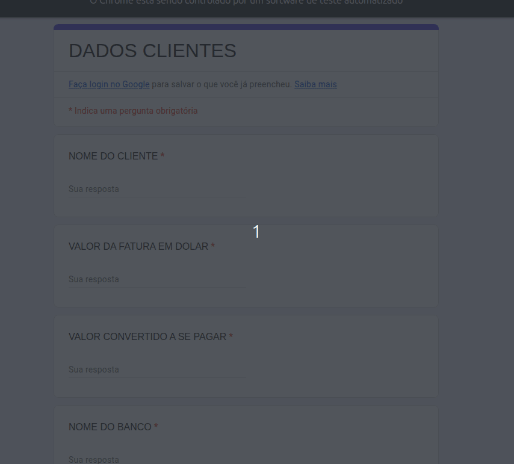
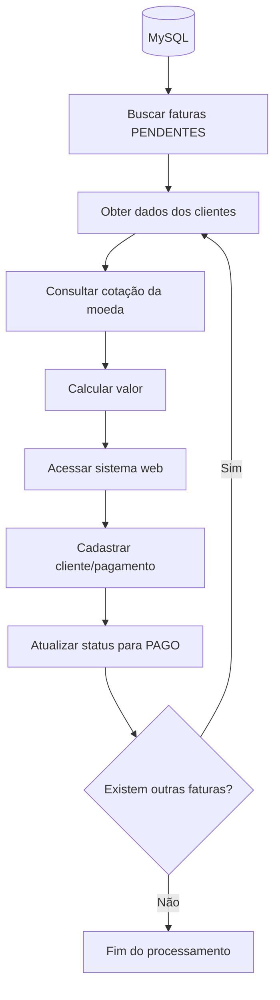

# 🤖 Automatizador de Pagamentos Internacionais

## 🎯 Descrição

Automação desenvolvida em Python para simular um processo de pagamentos
internacionais em um ambiente administrativo/financeiro.

O robô consulta faturas pendentes no banco de dados, combina os dados com
informações de clientes armazenadas em planilha, consulta a cotação das
moedas através de uma API, realiza o cadastro no sistema web e atualiza
o status da fatura após o processamento.

O projeto foi desenvolvido com foco em automação de processos, integração
entre sistemas e redução de tarefas manuais.

---

## 🎥 Demonstração

<p align="center">
  
</p>

---

## 🔄 Fluxo da automação



---

## ⚙️ Funcionalidades

- [x] Conexão com banco de dados MySQL
- [x] Consulta de faturas com status `PENDENTE`
- [x] Leitura de dados de clientes através de planilha
- [x] Junção dos dados do banco com os dados da planilha
- [x] Consulta de cotação de moedas através de API
- [x] Conversão de valores para a moeda correspondente
- [x] Automação do cadastro através do Selenium
- [x] Processamento das faturas pendentes em sequência
- [x] Atualização do status da fatura no banco de dados
- [x] Geração de planilha com os dados processados
- [x] Sistema de logs para acompanhamento da execução

---

## 🛠️ Tecnologias utilizadas

| Tecnologia | Utilização |
|---|---|
| 🐍 Python | Desenvolvimento da automação |
| 🗄️ MySQL | Armazenamento e consulta das faturas |
| 🐼 Pandas | Manipulação e tratamento dos dados |
| 🌐 Selenium | Automação do sistema web |
| 🔗 Requests | Consumo da API de cotação |
| 📦 Poetry | Gerenciamento de dependências |
| 🔧 Git | Controle de versão |
| 🔐 Snyk | Análise de vulnerabilidades |
| 🐧 Ubuntu | Ambiente de desenvolvimento |

---

## 📂 Estrutura do projeto

```text
.
├── adm_logger/
│   ├── __init__.py
│   └── loggin.py
│
├── conversor_moeda/
│   ├── __init__.py
│   └── total_pagar.py
│
├── manipulacao_dados/
│   ├── __init__.py
│   └── banco_dados.py
│
├── manipulacao_planilha/
│   ├── __init__.py
│   └── dados_planilha.py
│
├── tratamento_api/
│   ├── __init__.py
│   └── busca_api.py
│
├── tratamento_botweb/
│   ├── __init__.py
│   └── criacao_bot.py
│
├── .gitignore
├── poetry.lock
├── pyproject.toml
├── README.md
└── testes.py
```

---

## 🚀 Execução

### 1. Instalação do Poetry

Caso ainda não tenha o Poetry instalado:

```bash
pip install poetry
```

### 2. Instalação das dependências

Na raiz do projeto, execute:

```bash
poetry install
```

### 3. Configuração das variáveis de ambiente

Crie um arquivo de ambiente contendo as informações necessárias para
a conexão com o banco de dados:

```env
DB_SENHA=sua_senha
HOST_DB=localhost
DATABASE=seu_banco
PORT=3306
```

> **Importante:** o arquivo de variáveis de ambiente não deve ser enviado
> para o repositório. Adicione-o ao `.gitignore`.

### 4. Execução da automação

Execute:

```bash
poetry run python -m tratamento_botweb.criacao_bot
```

---

## 🗄️ Banco de dados

O projeto utiliza MySQL para armazenar e consultar as informações das
faturas.

A automação busca os registros com status:

```text
PENDENTE
```

Após o processamento realizado pelo robô, o status da fatura é atualizado
para:

```text
PAGO
```

> **Observação:** o projeto foi desenvolvido utilizando uma conexão
> MySQL local. Para executar a automação em outro ambiente, é necessário
> configurar o banco de dados e as variáveis de ambiente.

---

## 📊 Dados e planilhas

O projeto utiliza uma planilha contendo informações dos clientes e realiza
a integração desses dados com as informações obtidas no banco de dados.

Os dados são tratados utilizando Pandas antes de serem utilizados no
processo de automação.

Caso queira utilizar uma estrutura de planilha diferente, será necessário
adaptar o tratamento realizado em:

```text
manipulacao_planilha/
```

---

## 🔐 Segurança

As credenciais de acesso ao banco de dados são armazenadas através de
variáveis de ambiente e não devem ser versionadas.

O projeto também utiliza o **Snyk** para análise de vulnerabilidades
e dependências.

---

## 📝 Logs

Durante a execução, o projeto registra informações do processamento
através de um sistema de logs.

Os logs permitem acompanhar a execução da automação e identificar
eventuais erros durante o processo.

---

## 📌 Observações

Este projeto foi desenvolvido como uma demonstração prática de automação
de processos utilizando Python e integração entre diferentes tecnologias.

O fluxo simula um cenário de pagamentos internacionais, envolvendo
consulta de dados, tratamento de informações, consumo de API, automação
web e atualização de registros em banco de dados.